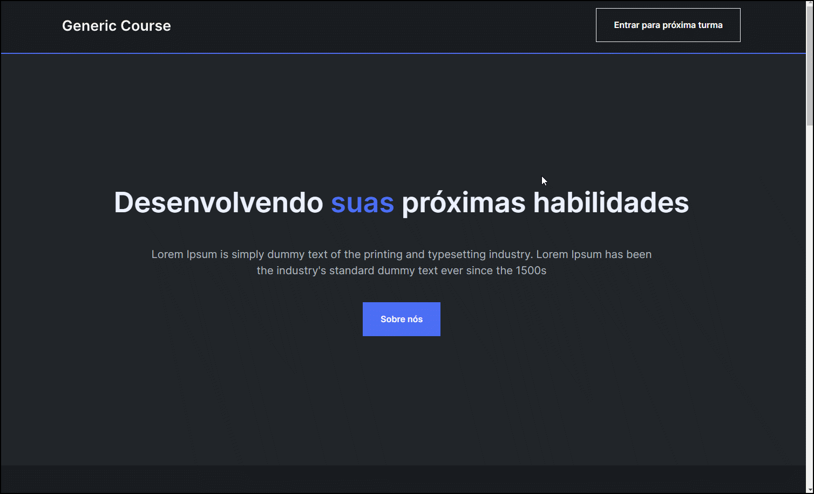

# Site Institucional Genérico

  

## Descrição

Este projeto tem como objetivo criar um site institucional responsivo a partir de um modelo de design criado no Figma. Inicialmente, o foco será no desenvolvimento da versão para desktop, seguindo as diretrizes visuais do designer. O site irá incorporar conceitos de variáveis CSS para facilitar a personalização e manutenção do estilo.

## Features

- **Desenvolvimento para Desktop:**

  - Implementado o layout do site conforme o modelo do Figma, utilizando HTML e CSS.
  - Utilizado variáveis CSS para manter a consistência visual e facilitar futuras modificações no estilo.
  - Integrado elementos interativos e animações de acordo com as especificações do design.

- **Adaptação Responsiva**

  - Após a conclusão da versão para desktop, site adaptado para dispositivos móveis e três resoluções específicas: 1024px, 768px e 425px.
  - Técnicas responsivas, como media queries e clamp() para ajustar o layout, fontes e espaçamentos para cada tela.
  - Implementado um modal interativo usando a tag <dialog> para melhorar a experiência do usuário em dispositivos móveis.

- **Posicionamento e Organização**

  - Utilizar propriedades de posicionamento CSS (como position e flexbox) para organizar as seções do site de maneira clara e funcional.
  - Garantir que o conteúdo esteja disposto de forma intuitiva, independentemente do tamanho da tela, para uma experiência de usuário coesa.
